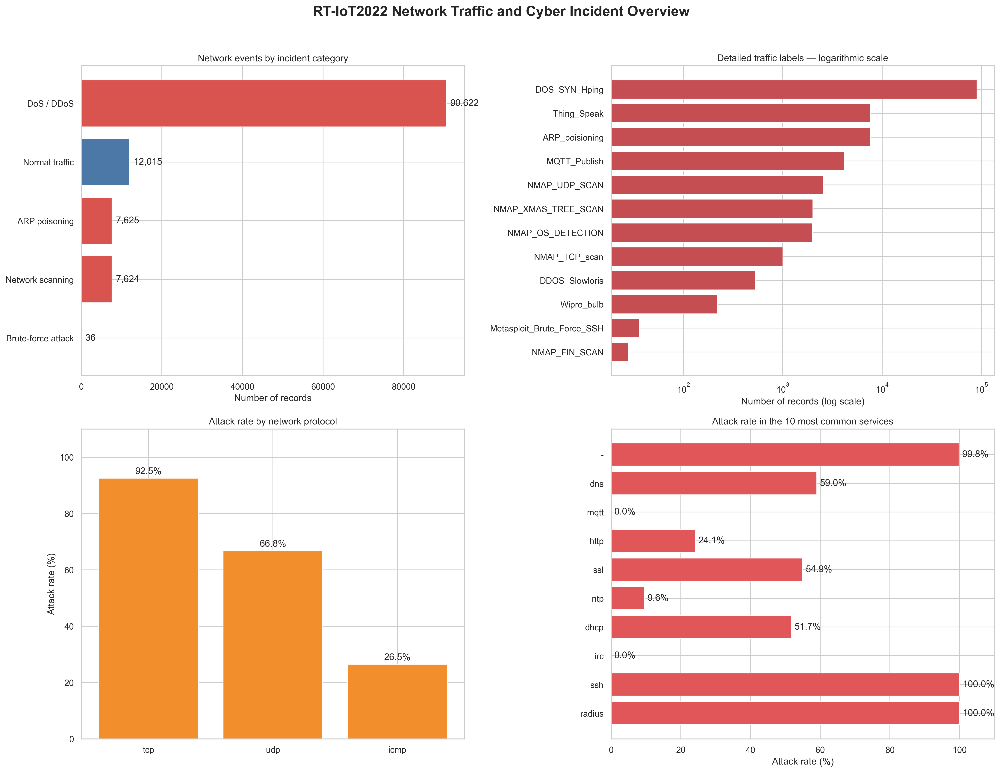
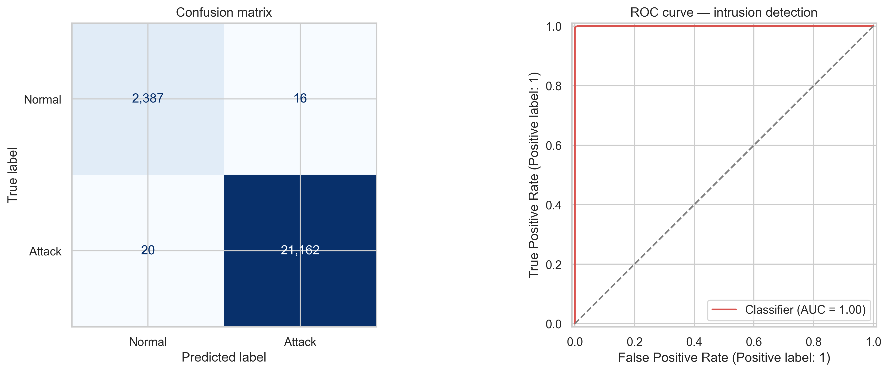
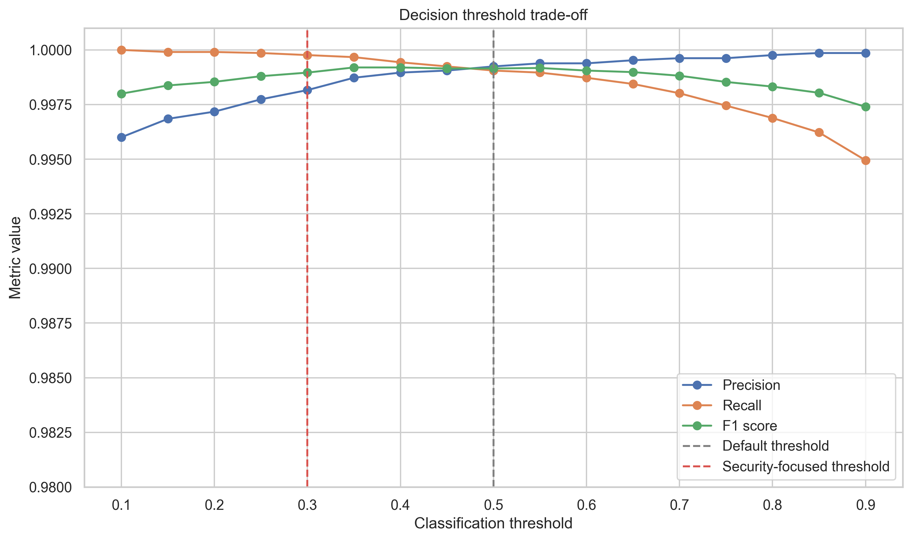
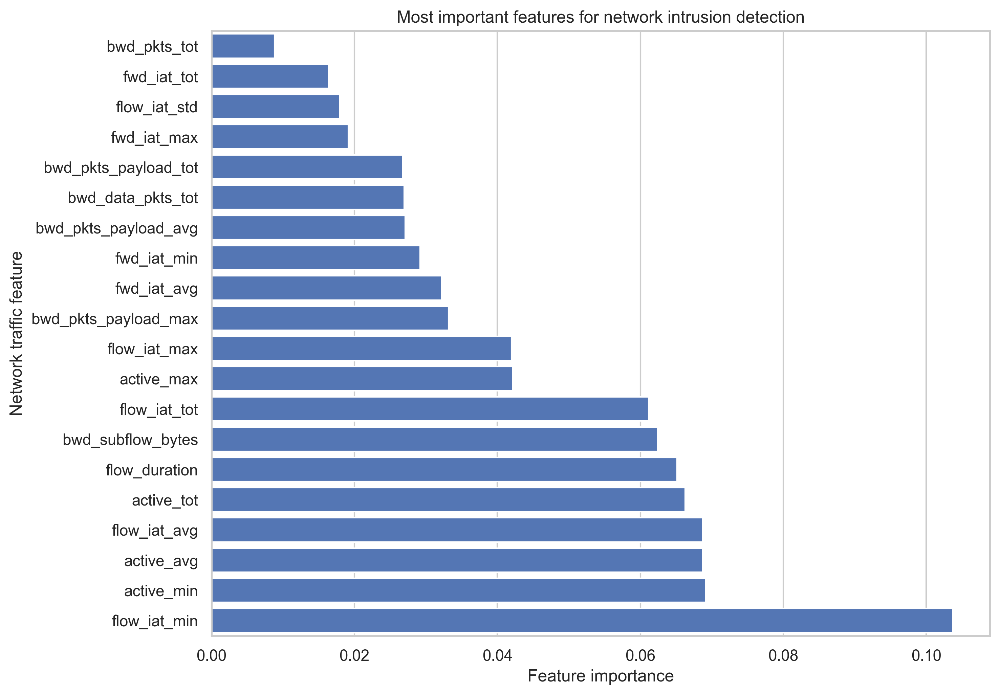

# Cybercrime Network Intrusion Analysis

A data analysis and machine-learning project focused on detecting malicious network traffic and investigating cybercrime-related incidents.

The project combines Python, SQL, data visualisation and classification modelling. It was created as a portfolio project relevant to cybersecurity analysis, digital investigations and data-driven police work.

## Project objectives

- inspect and clean network traffic data
- distinguish normal traffic from cyberattacks
- analyse different categories of network incidents
- identify the most important indicators of malicious activity
- build and evaluate an intrusion-detection model
- compare decision thresholds for security operations
- prepare SQL queries for incident investigation
- discuss operational limitations and responsible use

## Dataset

The project uses the **RT-IoT2022** dataset from the UCI Machine Learning Repository.

The dataset contains network traffic collected from an IoT infrastructure and includes:

- normal IoT network activity
- DoS and DDoS attacks
- ARP poisoning
- network scanning
- brute-force attacks

Source: [UCI Machine Learning Repository – RT-IoT2022](https://archive.ics.uci.edu/dataset/942/rt-iot2022)

## Technologies

- Python
- pandas
- NumPy
- matplotlib
- seaborn
- scikit-learn
- SQLite
- SQL
- JupyterLab

## Dataset preparation

The analysis included:

- standardising column names
- checking missing and infinite values
- removing duplicated records
- removing constant columns
- creating a binary attack indicator
- grouping detailed attack labels into investigation categories
- exporting a compressed cleaned dataset
- creating a compact SQLite investigation database

The final cleaned dataset contains **117,922 records**.

## Incident distribution

| Incident category | Records | Percentage |
|---|---:|---:|
| DoS / DDoS | 90,622 | 76.85% |
| Normal traffic | 12,015 | 10.19% |
| ARP poisoning | 7,625 | 6.47% |
| Network scanning | 7,624 | 6.47% |
| Brute-force attack | 36 | 0.03% |



## Intrusion-detection model

A Random Forest classifier was trained to distinguish attacks from normal network traffic.

The preprocessing pipeline includes:

- missing-value imputation
- numerical feature scaling
- one-hot encoding of categorical variables
- stratified training and test datasets
- class-balanced model training

### Model performance

| Metric | Result |
|---|---:|
| Accuracy | 0.9985 |
| Precision | 0.9992 |
| Recall | 0.9991 |
| F1 score | 0.9992 |
| ROC-AUC | 1.0000 |

The test set contained **23,585 records**.

At the default classification threshold of 0.50, the model produced:

- 21,162 correctly detected attacks
- 2,387 correctly identified normal records
- 20 missed attacks
- 16 false alarms



## Security-focused decision threshold

In cybersecurity operations, missing a real attack may be more costly than investigating an additional false alarm.

Reducing the decision threshold from 0.50 to 0.30 produced:

| Threshold | Precision | Recall | F1 score | Missed attacks | False alarms |
|---:|---:|---:|---:|---:|---:|
| 0.30 | 0.9982 | 0.9998 | 0.9990 | 5 | 39 |

This reduced the number of missed attacks from 20 to 5.



## Important network indicators

The most influential model features were primarily related to:

- time intervals between packets
- active connection periods
- total flow duration
- packet payload size
- forward and backward traffic behaviour



## SQL investigation

The project includes an SQLite database and SQL queries for:

- calculating incident-category distribution
- comparing attacks by network protocol
- calculating attack rates
- identifying targeted services
- analysing flow duration
- identifying frequently targeted destination ports
- investigating detailed attack types

The SQL queries are available in:

```text
sql/cybercrime_analysis.sql